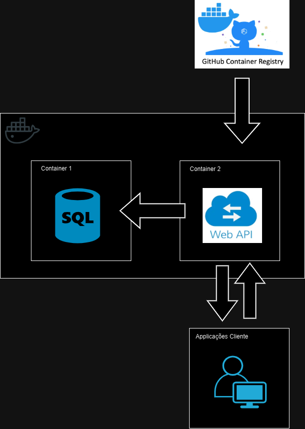

HACKATHON 4NETT

```
Grupo 31

- Paulo Abinair
- Rodrigo Leão
- Sandro Gonçalves
```

# Health&Med - MVP

Para atender os requisitos do desafio, foi desenvolvido um MVP de um backend de agendamento de consultas médicas baseado em containers Docker.

A arquitetura inicial foi pensada para atender ao MVP, sendo composta apenas por uma aplicação WebApi .NET Core 8.0 e um banco de dados SQL Server, rodando em containers.

O pipeline de CI/CD foi implementado no próprio repositório utilizando o GitHubActions. Além de realizar o build da aplicação, o workflow também inclui um job de deploy para montar e subir a imagem atualizada da API para o registro de containers do GitHub Packages





# Health&Med - Expansão da Arquitetura

Com o objetivo de atender os requisitos não funcionais solicitados no desafio, segue a nossa proposta para a expansão do MVP:

Utilização da Azure como provedor de serviços em nuvem, com a seguinte arquitetura:

- Azure Kubernetes Service (AKS) para orquestração de containers
- Azure SQL Database para armazenamento de dados
- Azure Key Vault para armazenamento de segredos
- Azure Monitor para monitoramento da aplicação
- Azure Api gateway para gerenciamento de APIs e balanceamento de carga

A implementação e deploy do MVP em containers foram feitos justamente visando uma futura expansão para kubernetes. Deste modo, a migração para AKS seria uma evolução natural da arquitetura proposta e garantiria a escalabilidade e alta disponibilidade da aplicação.

# Projeto do Hackaton

### Tecnologias Utilizada
- .NET Core 8.0
- Dapper
- SQL Server
- Docker
- GitHub Actions
- GitHub Packages

### Estrutura da Solution
```
hackaton
│
├── hackaton.Domain
│   ├── Entities
│   ├── ValueObjects
│   └── Repositories (Interfaces)
│
├── hackaton.Application
│   ├── Services
│   ├── DTOs
│   ├── Commands/Queries
│   └── Interfaces
│
├── hackaton.Infrastructure
│   ├── Data
│   ├── Repositories
│   ├── Configurations
│   └── Services
│
├── hackaton.API
│   ├── Controllers
│   ├── Models
│   └── Program.cs
│
├── hackaton.Tests
│   ├── UnitTests
│   └── IntegrationTests
│
└── hackaton.sln
```

### Banco de dados (SQL Server)

- Executar o comando  `docker-compose up -d`
- Para alterar e recriar o container `docker-compose up --build`
- Para remover o container `docker-compose down`

- Conexão
    - User = SA
    - Password = Teste123!
    - Database = AgendaMedica
    - Server = localhost

- Connection String
```
"ConnectionStrings": {
  "DefaultConnection": "Server=localhost;   Database=AgendaMedica;User Id=SA;Password=Teste123!;TrustServerCertificate=True"
}
```

### Pipeline Buid/Deploy (CI/CD)

- O pipeline de CI/CD foi implementado no próprio repositório utilizando o GitHubActions (https://github.com/FIAP-Pos-Tech-4NETT-Grupo-31/hackaton/actions)
- O workflow realiza o build da aplicação, executa os testes e faz o deploy da imagem da API para o registro de containers do GitHub Packages.

### Docker

- O projeto foi dockerizado para facilitar a execução e deploy da aplicação.
- O arquivo `Dockerfile` contém as instruções para criar a imagem da aplicação.
- O arquivo `docker-compose.yml` contém as configurações para subir o banco de dados e a aplicação em containers.
- O arquivo `docker-compose-release.yml` contém as configurações para subir a aplicação em modo release. 

### Execução em Modo Debug

Após executar o comando `docker-compose up -d`, para subir o banco de dados, basta executar a aplicação WebAPI no Visual Studio.

### Execução em Modo Release
No modo release, além de subir o banco de dados, o docker-compose-release.yml está sendo usado para recuperar e executar a imagem do projeto WebAPI que foi publicada no GitHub Packages.

```$ docker-compose -p hackaton-release -f .\docker-compose-release.yml up -d ```
